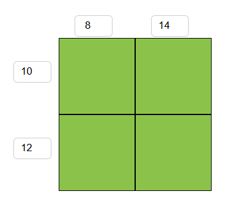
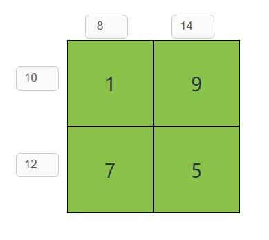

# kakuro

Solve the game of Kakuro

## The puzzle

Kakuro belongs to the class of constraint-satisfaction problems (CSP). You need to fill out the cells such that within a row or a column of consecutive cells, there are no two cells containing the same number. Moreover, you also need to satisfy the sum constraint, each constraint applies to a set of consecutive cells in a row or a column.

For example, the following puzzle:



Means that, assuming the matrix of solution is `A`, then we have the following equations:

```
A[0][0] + A[0][1] = 10
A[1][0] + A[1][1] = 12
A[0][0] + A[1][0] = 8
A[0][1] + A[1][1] = 14
```

And a solution to the above puzzle is as follows:



## Usage

### CLI

If you wish to test the game with a CLI programme, make sure you have python `3.10` on your computer. Note that you do not need to install any package, those indicated in `requirements.txt` are only for the server. Run the following command:

```bash
python cli.py
```

You can then indicate the puzzle. Note that when you are asked to indicate the board in binary format, `1` means that the corresponding cell is used in the puzzle, and `0` indicates that the corresponding cell is not used in the puzzle.

### Website

You can visit [our deployed site](https://kakuro.nknguyenhc.net) to test it out in the web browser. Note that it is best to visit the site on a computer.
